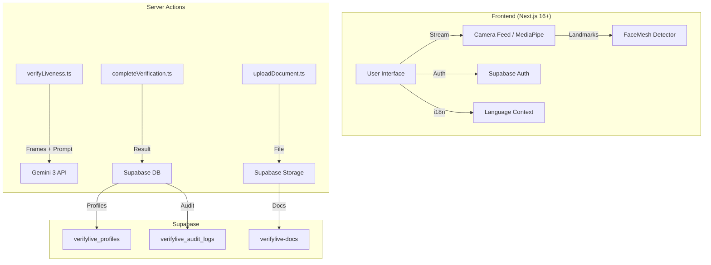

# VerifyLive 🛡️


[](https://verifylive.vercel.app)
[](https://ai.google.dev/competition)

> **🏆 Official Entrant of GEMINI 3 HACKATHON**  
> _Biometric Liveness Detection & Anti-Deepfake System powered by Gemini 3 Multimodal._  
> _Full Compliance with LGPD, Lei Felca & International Biometric Standards._

<div align="center">
  
</div>

<div align="center">

```text
   █████╗ ██╗███████╗██╗  ██╗██╗  ██╗
   ██╔══██╗██║██╔════╝╚██╗██╔╝╚██╗██╔╝
   ███████║██║█████╗   ╚███╔╝  ╚███╔╝
   ██╔══██║██║██╔══╝   ██╔██╗  ██╔██╗
   ██║  ██║██║███████╗██╔╝ ██╗██╔╝ ██╗
   ╚═╝  ╚═╝╚═╝╚══════╝╚═╝  ╚═╝╚═╝  ╚═╝
```

**Developed by [AIExxplorer](https://github.com/AIExxplorer) | [Artificial Universe](https://artificialuniverse.tech)**

**[🇧🇷 Leia em Português](./README_PT.md)**

</div>

---

## 📋 Table of Contents

- [🎯 Overview](#-overview)
- [✨ Key Features](#-key-features)
- [🏗️ Technical Architecture](#️-technical-architecture)
- [🔒 Security & Compliance](#-security--compliance)
- [🚀 Installation & Configuration](#-installation--configuration)
- [📱 User Flow](#-user-flow)
- [🧠 Gemini 3 Integration](#-gemini-3-integration)
- [📊 Database](#-database)
- [🎥 Demo & Links](#-demo--links)
- [🤝 Contributing](#-contributing)
- [📝 License](#-license)

---

## 🎯 Overview

**VerifyLive** is a forensic-grade biometric verification system developed for the **Gemini 3 Hackathon**. It leverages the **Action Era** capabilities of the **Gemini 3 Multimodal API** to perform deep semantic reasoning on video streams, detecting deepfakes and ensuring real-time liveness.

### 🎯 Project Objectives

| Objective                   | Description                                                            |
| :-------------------------- | :--------------------------------------------------------------------- |
| **Identity Verification**   | Confirm the user is a real person, not a photo, video, or deepfake     |
| **Anti-Deepfake Detection** | Use forensic AI to identify synthetic manipulations in real-time video |
| **Regulatory Compliance**   | Meet LGPD, Lei Felca, and international biometric standards            |
| **Immutable Audit**         | Maintain encrypted and traceable logs of all verifications             |
| **Premium Experience**      | Intuitive, responsive, and accessible interface for all devices        |

### 🏆 Alignment with Hackathon Theme

This project aligns with the **Action Era** and **Omni-Agent** themes through:

- **Native Multimodality**: Direct processing of video/audio streams via Gemini 3
- **Thought Signatures**: Explainable forensic reasoning for every liveness decision
- **Human-AI Synergy**: Empowering compliance auditors with AI-generated forensic reports

---

## ✨ Key Features

### 🔐 Secure Authentication

- **Google OAuth 2.0** integrated via Supabase Auth
- Secure sessions with auto-refresh tokens
- Server-side route protection

### 📄 Document Verification

- **PDF Upload** (Digital Driver's License, Gov.br ID)
- **Camera Capture** (Front & Back)
- Support for ID cards, Driver's Licenses, and Passports
- MIME type validation and max size checks (5MB)

### 🎥 Liveness Detection

- **5 Verification Challenges**:
  1. 😐 **Neutral Face** - Baseline position
  2. 👉 **Turn Right** - 3D structure check
  3. 😊 **Smile** - Muscle/expression check
  4. 🔍 **Zoom In** - Depth check
  5. 🤚 **Hand Check** - Possession/Occlusion check (anti-deepfake)

### 🧠 Forensic Analysis with Gemini 3

- Multimodal reasoning on 5 captured frames
- Detection of deepfake artifacts (moiré patterns, blurring, distortions)
- Confidence score (0-100%) with explanation
- Exportable forensic report

### 📊 Status Dashboard

- **"Unverified" Badge** for pending accounts
- **"Verified" Dashboard** upon successful completion
- Verification history with timestamps
- Re-verification prevention (anti-loop)

---

## 🏗️ Technical Architecture

### Complete Tech Stack



### 🌍 Internationalization (i18n)

- **Multilingual Support**: Portuguese (PT), English (EN), and Spanish (ES).
- **Auto-Detection**: Browser preference or manual selection.
- **Floating Switcher**: Minimalist interface with Glassmorphism.

### Tech Badges


---

## 🔒 Security & Compliance

### 🇧🇷 LGPD (General Data Protection Law)

| Requirement           | Implementation                                      |
| :-------------------- | :-------------------------------------------------- |
| **Explicit Consent**  | Mandatory terms modal before verification           |
| **Specific Purpose**  | Data used exclusively for identity verification     |
| **Data Minimization** | Only strictly necessary data is collected           |
| **Transparency**      | Direct links to official legislation (Planalto.gov) |
| **Right of Access**   | Audit history available to the user                 |
| **Security**          | AES-256 encryption at rest, TLS 1.3 in transit      |
| **Auto-TTL**          | Automatic deletion of raw data after 24h            |

### 👶 Lei Felca / ECA (Child Protection)

| Measure                 | Description                                     |
| :---------------------- | :---------------------------------------------- |
| **Age Detection**       | Automatic flags for users apparently under 16   |
| **Guardian Consensus**  | Flow blocked for minors without guardian tokens |
| **Cryptographic Audit** | All age decisions are signed and logged         |

### 🔐 Technical Security Measures

```
┌────────────────────────────────────────────────────────────┐
│                   SECURITY LAYERS                          │
├────────────────────────────────────────────────────────────┤
│                                                            │
│  1. AUTHENTICATION                                         │
│     ├── Google OAuth 2.0 (PKCE Flow)                      │
│     ├── JWT Tokens with auto-refresh                      │
│     └── HTTPOnly + Secure Session Cookies                 │
│                                                            │
│  2. AUTHORIZATION                                          │
│     ├── Row Level Security (RLS) in Supabase              │
│     ├── Per-user policies (auth.uid())                    │
│     └── Isolated Service Role Key on server               │
│                                                            │
│  3. ENCRYPTION                                             │
│     ├── In Transit: TLS 1.3                               │
│     ├── At Rest: AES-256 (Supabase Storage)               │
│     └── Hashing: bcrypt for sensitive data                │
│                                                            │
│  4. VALIDATION                                             │
│     ├── MIME type validation (image/jpeg, pdf)            │
│     ├── Size limit (5MB per file)                         │
│     └── Input sanitization                                │
│                                                            │
│  5. AUDIT                                                  │
│     ├── Immutable logs in verifylive_audit_logs           │
│     ├── IP and User-Agent logging                         │
│     └── Timestamps with UTC timezone                      │
│                                                            │
│  6. ANTI-FRAUD PROTECTION                                  │
│     ├── Deepfake Detection via Gemini 3                   │
│     ├── 5 liveness challenges (3D movement)               │
│     └── Facial consistency verification                   │
│                                                            │
└────────────────────────────────────────────────────────────┘
```

### 📜 Legal References Implemented

- [Lei 13.709/2018 - LGPD](https://www.planalto.gov.br/ccivil_03/_ato2015-2018/2018/lei/L13709.htm)
- [Lei 14.063/2020 - Electronic Signature](https://www.planalto.gov.br/ccivil_03/_ato2019-2022/2020/lei/L14063.htm)
- [Lei 8.069/1990 - ECA (Statute of the Child and Adolescent)](https://www.planalto.gov.br/ccivil_03/leis/l8069.htm)

---

## 🚀 Installation & Configuration

### Prerequisites

- Node.js 20+
- npm 10+ or pnpm
- Supabase Project (PostgreSQL + Auth + Storage)
- Google AI API Key (Gemini)

### 1. Clone the Repository

```bash
git clone https://github.com/AIExxplorer/verifylive.git
cd verifylive
```

### 2. Install Dependencies

```bash
npm install
```

### 3. Configure Environment Variables

Create a `.env.local` file in the project root:

```env
# Supabase
NEXT_PUBLIC_SUPABASE_URL=https://your-project.supabase.co
NEXT_PUBLIC_SUPABASE_ANON_KEY=your-anon-key
SUPABASE_SERVICE_ROLE_KEY=your-service-role-key

# Google AI (Gemini)
GEMINI_API_KEY=your-gemini-api-key

# App
NEXT_PUBLIC_APP_URL=http://localhost:3000
```

### 4. Configure Supabase

Run the SQL schema in the Supabase SQL Editor:

```sql
-- See the full supabase_schema.sql file in the repository
```

Configure the **Google OAuth Provider** at:
`Authentication > Providers > Google`

Create the storage buckets:

- `verifylive-docs` (Private)
- `verifylive-proofs` (Private)

### 5. Run in Development

```bash
npm run dev
```

Access: [http://localhost:3000](http://localhost:3000)

### 6. Production Build

```bash
npm run build
npm start
```

---

## 📱 User Flow

```
┌─────────────────────────────────────────────────────────────────┐
│                        USER JOURNEY                             │
└─────────────────────────────────────────────────────────────────┘

    ┌──────────────┐
    │    ACCESS    │
    │    (Page)    │
    └──────┬───────┘
           │
           ▼
    ┌──────────────┐      NO        ┌──────────────┐
    │  Logged In?  │ ────────────▶  │    LOGIN     │
    │              │                │   (Google)   │
    └──────┬───────┘                └──────┬───────┘
           │ YES                           │
           ▼                               │
    ┌──────────────┐                       │
    │  Verified?   │ ◀─────────────────────┘
    │              │
    └──────┬───────┘
           │
     YES   │   NO
           │
    ┌──────┴───────┐          ┌──────────────┐
    │  DASHBOARD   │          │  COMPLIANCE  │
    │  VERIFIED    │          │   (Modal)    │
    │  ✅ Badge    │          └──────┬───────┘
    └──────────────┘                 │
                                     ▼
                              ┌──────────────┐
                              │  DOCUMENTS   │
                              │  (Selection) │
                              └──────┬───────┘
                                     │
                         ┌───────────┴───────────┐
                         │                       │
                    ┌────▼────┐            ┌────▼────┐
                    │ CAMERA  │            │   PDF   │
                    │ (F + B) │            │ Upload  │
                    └────┬────┘            └────┬────┘
                         │                      │
                         └───────────┬──────────┘
                                     │
                                     ▼
                              ┌──────────────┐
                              │   LIVENESS   │
                              │    INTRO     │
                              └──────┬───────┘
                                     │
                                     ▼
                              ┌──────────────┐
                              │   5 STEPS    │
                              │   LIVENESS   │
                              │   (Camera)   │
                              └──────┬───────┘
                                     │
                                     ▼
                              ┌──────────────┐
                              │  ANALYZING   │
                              │  (Gemini 3)  │
                              └──────┬───────┘
                                     │
                                     ▼
                              ┌──────────────┐
                              │    RESULT    │
                              │   ✅ / ❌    │
                              └──────────────┘
```

---

## 🧠 Gemini 3 Integration

### Forensic Prompt Used

```typescript
const prompt = `
Analyze this sequence of 5 video frames for liveness. 
The user was asked to perform the following challenges in order:
1. Neutral Face
2. Turn Right (3D check)
3. Smile/Expression (Muscle check)
4. Zoom In (Depth check)
5. Hold ID/Hand (Possession/Occlusion check)

FORENSIC ANALYSIS REQUIRED:
- **Consistency**: Do features remain consistent across angles/lighting?
- **3D Structure**: Does the face rotate naturally or warp like a 2D texture?
- **Micro-expressions**: Are eye movements and muscle flexes natural?
- **Artifacts**: Look for screen moire, edge blurring, or glitching.

Return JSON with:
- is_real: boolean
- confidence: number (0-100)
- anomalies: string[] (list suspicious elements)
- reasoning: string (brief explanation of the verdict)
`;
```

### Expected Response

```json
{
  "is_real": true,
  "confidence": 98,
  "anomalies": [],
  "reasoning": "Features consistent across all 5 angles. Natural 3D rotation detected. No deepfake artifacts found."
}
```

---

## 📊 Database

### Main Schema

```sql
-- Verification Profiles
CREATE TABLE verifylive_profiles (
  id UUID REFERENCES auth.users PRIMARY KEY,
  updated_at TIMESTAMPTZ,
  username TEXT UNIQUE,
  full_name TEXT,
  avatar_url TEXT,
  is_verified BOOLEAN DEFAULT FALSE,
  verified_at TIMESTAMPTZ
);

-- Audit Logs (Immutable)
CREATE TABLE verifylive_audit_logs (
  id UUID DEFAULT gen_random_uuid() PRIMARY KEY,
  created_at TIMESTAMPTZ DEFAULT NOW(),
  user_id UUID REFERENCES auth.users(id),
  action TEXT NOT NULL,
  status TEXT NOT NULL,
  confidence NUMERIC,
  metadata JSONB,
  ip_address TEXT,
  user_agent TEXT
);
```

### RLS Policies

- Users can only view/edit their own profiles
- Audit logs are inserted via Service Role (immutable for the user)
- Storage protected by owner policies

---

## 🎥 Demo & Links

| Resource                   | Link                                                       |
| :------------------------- | :--------------------------------------------------------- |
| 🌐 **Live Demo**           | [verifylive.vercel.app](https://verifylive.vercel.app)     |
| 📹 **Demo Video**          | [YouTube](https://youtube.com) _(Coming Soon)_             |
| 🏆 **Devpost**             | [Submission Link](https://devpost.com)                     |
| 📂 **Repository**          | [GitHub](https://github.com/AIExxplorer/verifylive)        |
| 🔗 **Artificial Universe** | [artificialuniverse.tech](https://artificialuniverse.tech) |

---

## 🤝 Contributing

This project uses **Husky** for git hooks and **Commitlint** for conventional commits.

### Commit Standards

```bash
feat: new feature
fix: bug fix
docs: documentation update
style: formatting (no logic change)
refactor: code refactoring
test: adding tests
chore: maintenance tasks
```

### 🌳 Branch Structure (GitFlow)

This project follows a **Simplified GitFlow** workflow:

```
                    ┌──────────────┐
                    │     main     │  ← Production (Stable)
                    └──────┬───────┘
                           │
                    ┌──────▼───────┐
                    │   develop    │  ← Integration (Default Dev)
                    └──────┬───────┘
                           │
          ┌────────────────┼────────────────┐
          │                │                │
   ┌──────▼──────┐  ┌──────▼──────┐  ┌──────▼──────┐
   │ feature/*   │  │   test/qa   │  │  hotfix/*   │
   └─────────────┘  └─────────────┘  └─────────────┘
```

| Branch      | Purpose                                  |
| :---------- | :--------------------------------------- |
| `main`      | Production code, stable releases         |
| `develop`   | Integration branch, receives feature PRs |
| `test/qa`   | Staging and QA testing                   |
| `feature/*` | New features                             |
| `hotfix/*`  | Urgent production fixes                  |

### 📋 Community Templates

This repository includes standardized templates to facilitate contributions:

| Template                                                     | Description                             |
| :----------------------------------------------------------- | :-------------------------------------- |
| [Bug Report](.github/ISSUE_TEMPLATE/bug_report.md)           | Bug reporting with technical context    |
| [Feature Request](.github/ISSUE_TEMPLATE/feature_request.md) | Suggestion for new features             |
| [Pull Request](.github/PULL_REQUEST_TEMPLATE.md)             | Template for PRs with quality checklist |

### Contribution Flow

1. **Fork** the repository
2. Create a branch from `develop` (`git checkout -b feature/my-feature develop`)
3. Make your commits following **Conventional Commits** (Husky will validate)
4. Push to your branch (`git push origin feature/my-feature`)
5. Open a **Pull Request** pointing to `develop`
6. Wait for review and approval

> 📖 **Full Guide:** See [CONTRIBUTING.md](CONTRIBUTING.md) for detailed instructions.

---

## 📝 License

This project is licensed under the [MIT License](LICENSE).

```text
MIT License

Copyright (c) 2026 AIExxplorer / Artificial Universe

Permission is hereby granted, free of charge, to any person obtaining a copy
of this software and associated documentation files (the "Software"), to deal
in the Software without restriction, including without limitation the rights
to use, copy, modify, merge, publish, distribute, sublicense, and/or sell
copies of the Software...
```

---

<div align="center">

### 🛡️ VerifyLive

_Biometric Identity Verification for the AI Era_

**Built for Gemini 3 Hackathon | Google DeepMind**

```text
   █████╗ ██╗███████╗██╗  ██╗██╗  ██╗
   ██╔══██╗██║██╔════╝╚██╗██╔╝╚██╗██╔╝
   ███████║██║█████╗   ╚███╔╝  ╚███╔╝
   ██╔══██║██║██╔══╝   ██╔██╗  ██╔██╗
   ██║  ██║██║███████╗██╔╝ ██╗██╔╝ ██╗
   ╚═╝  ╚═╝╚═╝╚══════╝╚═╝  ╚═╝╚═╝  ╚═╝
```

**[⬆ Back to Top](#verifylive-️)**

</div>
